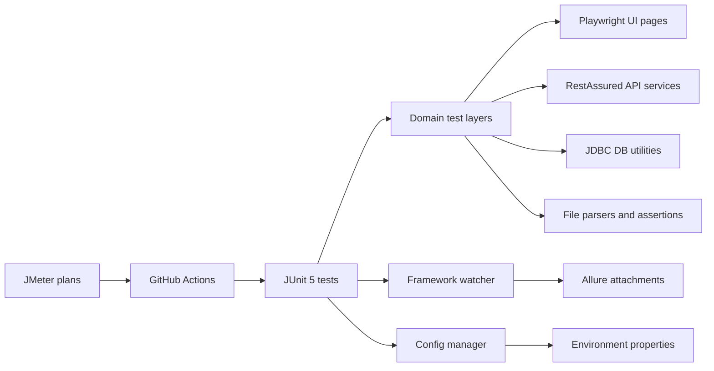

# Automation Framework Portfolio Project

A flagship Java automation framework built to demonstrate enterprise-grade SDET engineering across UI, API, database, file, and performance testing. The project is designed to be equally useful as a real framework, a recruiter-facing portfolio piece, and a consulting demo asset.

## Why this framework stands out

- Playwright Java UI automation with maintainable page objects and failure evidence capture
- RestAssured API layer with reusable client and service abstractions
- JDBC-based database verification with environment-driven configuration
- File verification utilities for text, CSV, TSV, JSON, XML, and generated outputs
- Allure reporting with screenshots, DOM snapshots, and API attachments
- JMeter performance assets for smoke-level API performance checks
- GitHub Actions workflows for functional and performance execution
- Maven + JUnit 5 execution model with tag-based targeting and parallel execution

## Feature matrix

| Capability | Implementation |
| --- | --- |
| UI automation | Playwright Java + JUnit 5 |
| API automation | RestAssured + reusable service layer |
| DB verification | JDBC + H2 demo data + env config |
| File verification | Commons CSV + Jackson + XML DOM |
| Reporting | Allure + screenshots + DOM capture |
| Performance | JMeter non-GUI sample plan |
| CI/CD | GitHub Actions |
| Build tool | Maven |

## Recommended architecture



## Project structure

- `src/main/java/com/automation/framework/config`: config-driven execution and environment resolution
- `src/main/java/com/automation/framework/ui`: Playwright session management and page objects
- `src/main/java/com/automation/framework/api`: reusable API client and services
- `src/main/java/com/automation/framework/db`: JDBC utilities for backend verification
- `src/main/java/com/automation/framework/files`: file parsing and assertion helpers
- `src/main/java/com/automation/framework/reporting`: Allure attachment helpers
- `src/test/java/com/automation/framework/tests`: UI, API, DB, file, and integration scenarios
- `src/test/resources/config`: base and environment-specific properties
- `src/test/resources/data`: request payloads and file-verification fixtures
- `src/test/resources/db`: schema and seed scripts for demo DB verification
- `performance/jmeter/plans`: sample JMeter performance assets
- `.github/workflows`: CI workflows for functional and performance execution
- `docs`: architecture, contribution guidance, and troubleshooting

## Prerequisites

- Java 17+
- Maven 3.9+
- Internet access for public demo systems used by Playwright and RestAssured examples
- Optional: Allure CLI for local HTML report generation
- Optional: Apache JMeter 5.6+ for local performance execution

## Quick start

```bash
mvn clean test
```

Targeted runs:

```bash
mvn clean test -Pui -Dheadless=true
mvn clean test -Papi
mvn clean test -Pdb
mvn clean test -Pfiles
mvn clean test -Pintegration
mvn clean test -Dgroups=smoke
mvn clean test -Denv=qa -Dbrowser=firefox -Dheadless=false
```

## Execution flow

1. Maven resolves dependencies and launches JUnit 5.
2. `ConfigManager` merges default and environment-specific properties.
3. The requested test layer runs against public demo systems or local fixtures.
4. Failure evidence is attached to Allure automatically.
5. CI uploads Allure result artifacts and, for performance runs, JMeter reports.


## Failure demo mode

The framework includes opt-in failing tests for demo and reporting screenshots. They are disabled by default so normal CI stays green.

```bash
mvn clean test -Pfailure-demo
mvn clean test -Pfailure-demo -Dgroups=ui,demo-failure
mvn clean test -Pfailure-demo -Dgroups=api,demo-failure
```
## Reporting

Allure result files are written to `allure-results`, the persistent HTML report is generated in `allure-report`, Maven test reports are written to `reports/surefire`, and framework logs are written to `logs/automation-framework.log`.

```bash
mvn clean test
mvn allure:report
mvn allure:serve`r`nmvn allure:report
```

For UI failures, the framework attaches:

- Full-page screenshot
- Page DOM snapshot
- Failure reason text

## Use cases this framework demonstrates

- E-commerce UI smoke checks with cart verification
- CRUD-style API verification with reusable service methods
- Database verification after upstream workflow activity
- File-level verification for generated execution outputs
- Lightweight API performance smoke coverage via JMeter

## Documentation index

- [Architecture](docs/ARCHITECTURE.md)
- [Running Tests](docs/RUNNING_TESTS.md)
- [Contributing Guide](docs/CONTRIBUTING.md)
- [Troubleshooting](docs/TROUBLESHOOTING.md)

## Showcase ideas

- Add screenshots from generated Allure reports under `docs/assets/`
- Publish the Allure HTML report with GitHub Pages
- Record a short walkthrough showing UI, API, DB, file, and JMeter execution paths


